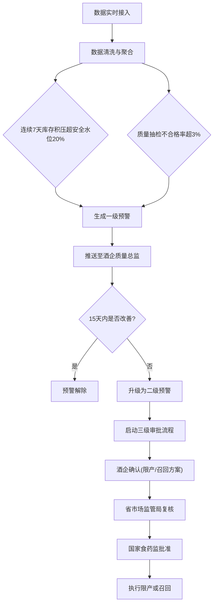
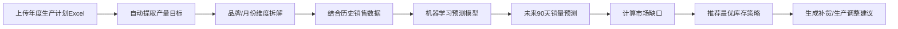

# 全国性酒类生产与流通智能监测分析平台 - 产品需求文档

## 1. 产品概述

全国性酒类生产与流通智能监测分析平台，面向国家、省、市三级市场监管部门及酒类生产企业，实时接入生产、库存、物流、销售、质检全链路数据，通过智能计算与预警机制，实现酒类产品全生命周期监管，保障食品安全，优化产业资源配置。

## 2. 核心功能

### 2.1 用户角色

| 角色 | 注册方式 | 核心权限 |
|------|---------|---------|
| 国家食药监管理员 | 系统创建 | 全国数据总览、二级预警最终审批、全国报表导出 |
| 省市场监管局用户 | 系统创建 | 所辖省份数据查看、二级预警复核、省级报表导出 |
| 市市场监管局用户 | 系统创建 | 所辖地市数据查看、市级报表导出 |
| 酒企质量总监 | 企业注册+审核 | 本企业数据查看、一级预警处理、预警确认、生产计划上传 |
| 酒企生产主管 | 企业注册+审核 | 本企业生产数据录入、库存管理、计划查看 |

### 2.2 功能模块

1. **登录与权限控制**：三级权限体系，角色数据范围隔离
2. **核心监测看板**：全国产销热力图、质量排名、KPI指标卡片、省份下钻
3. **预警中心**：一级/二级预警列表、预警详情、三级审批流程
4. **生产计划管理**：Excel上传、目标提取、90天缺口预测、库存策略推荐
5. **运营诊断报告**：周报自动生成、同比环比分析、质量事故分析、满意度排名
6. **企业数据管理**：酒企基础信息维护、数据接入状态监控

### 2.3 页面详情

| 页面名称 | 模块名称 | 功能描述 |
|---------|---------|----------|
| 登录页 | 登录表单 | 账号密码登录、角色身份标识、验证码 |
| 核心看板 | 顶部导航 | 用户信息、角色切换、消息通知、退出登录 |
| 核心看板 | KPI指标卡 | 全国总产量、总销量、产销率、平均库存周转天数、质量合格率、预警数量 |
| 核心看板 | 产销热力图 | 全国各省产销数据可视化、按省份/品牌切换、点击下钻 |
| 核心看板 | 质量排名榜 | 品牌合格率排名、产区质量排名、TOP10榜单 |
| 核心看板 | 省份下钻面板 | 地市销售趋势7天曲线、质检问题饼图分布、地市列表 |
| 核心看板 | 实时数据流水 | 最新接入的生产/销售/质检数据滚动展示 |
| 预警中心 | 预警概览统计 | 一级预警数、二级预警数、待审批数、已处理数 |
| 预警中心 | 预警列表 | 预警类型筛选、等级筛选、时间筛选、搜索、状态标签 |
| 预警中心 | 预警详情抽屉 | 预警触发原因、历史数据曲线、处理记录、审批操作 |
| 预警中心 | 审批流程面板 | 三级审批进度、意见输入、文件上传、操作日志 |
| 生产计划 | 计划上传区 | Excel拖拽上传、模板下载、格式校验、数据预览 |
| 生产计划 | 产量目标提取 | 自动识别月度/季度/年度产量目标、品牌维度拆解 |
| 生产计划 | 90天预测 | 销量预测曲线、市场缺口计算、供需平衡分析 |
| 生产计划 | 库存策略推荐 | 最优安全库存、补货建议、周转优化建议 |
| 运营报告 | 报告列表 | 周报列表、报告生成时间、报告状态、导出按钮 |
| 运营报告 | 报告详情 | 产销率同比环比图表、质量事故原因分布、品牌满意度TOP10、趋势对比 |
| 运营报告 | 优化建议 | 生产调度优化、质检重点推荐、趋势预警 |
| 企业管理 | 企业列表 | 酒企名录、接入状态、所属地区、信用评级 |
| 企业管理 | 企业详情 | 基本信息、数据接入配置、历史预警记录 |

## 3. 核心流程

### 3.1 预警触发与处理流程

### 3.2 生产计划与预测流程

## 4. 用户界面设计

### 4.1 设计风格

- **主色调**：深靛蓝 `#1E293B` 搭配金色 `#D4A574`，体现监管权威与酒类品质
- **辅助色**：成功绿 `#10B981`、警告橙 `#F59E0B`、危险红 `#EF4444`、信息蓝 `#3B82F6`
- **按钮风格**：圆角矩形（8px），主按钮采用渐变效果，悬停微上浮动画
- **字体方案**：标题使用 "Noto Serif SC" 宋体体系现典雅，正文使用 "Noto Sans SC" 黑体保证可读性
- **布局风格**：卡片式布局 + 侧边导航，信息层级分明，卡片带微阴影与圆角
- **图标风格**：线性图标为主，关键指标搭配微立体图标动效
- **背景纹理**：深色模式下添加细腻的颗粒噪点纹理，增强质感

### 4.2 页面设计概览

| 页面名称 | 模块名称 | UI元素 |
|---------|---------|--------|
| 登录页 | 品牌区域 | 深色渐变背景、金色Logo、平台名称副标题、动效装饰线条 |
| 登录页 | 表单区域 | 玻璃拟态卡片、悬浮输入框、角色选择下拉、动画登录按钮 |
| 核心看板 | KPI指标卡 | 金色边框渐变卡、数值滚动动画、趋势箭头、环比小标签 |
| 核心看板 | 产销热力图 | 交互式SVG中国地图、颜色渐变映射数值、省份hover高亮浮层 |
| 核心看板 | 质量排名榜 | 金银铜牌装饰、进度条填充、排名变化动画、奖牌微闪光效果 |
| 核心看板 | 下钻面板 | 右侧滑出抽屉、双折线趋势图、环形饼图、地市卡片网格 |
| 预警中心 | 预警卡片 | 红色/橙色渐变警示条、脉冲动效、倒计时标签、优先级角标 |
| 预警中心 | 审批流程 | 时间轴式审批流、节点状态图标、连线进度动画 |
| 生产计划 | 上传区 | 虚线边框拖拽区、文件图标浮动、进度条上传动画 |
| 生产计划 | 预测图表 | 面积图+折线组合、置信区间阴影、关键节点标注 |
| 运营报告 | 报告封面 | 证书式边框设计、金色印章元素、报告编号 |

### 4.3 响应式设计

- **桌面优先**：1920px基准设计，支持1280-2560px自适应
- **侧边导航**：1366px以下自动折叠为图标模式，hover展开
- **热力图区域**：小屏幕下地图自适应缩放，浮层改为顶部弹出
- **表格组件**：1024px以下启用横向滚动，关键列固定
- **触控优化**：按钮最小高度44px，卡片点击区域外扩8px

### 4.4 数据可视化指导

- **环境氛围**：深色主题下图表采用高对比度配色，网格线半透明弱化
- **动效节奏**：数据加载采用骨架屏渐入，图表数值缓动动画（800ms）
- **交互动效**：热力图省份悬停放大1.02倍+阴影加深；卡片悬停Y轴上移2px
- **性能控制**：单页图表不超过6个，大数据量采用Canvas渲染降级
