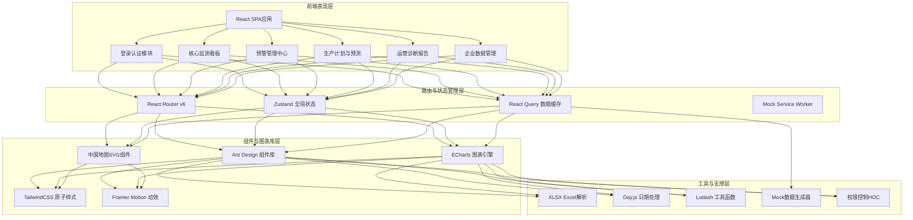
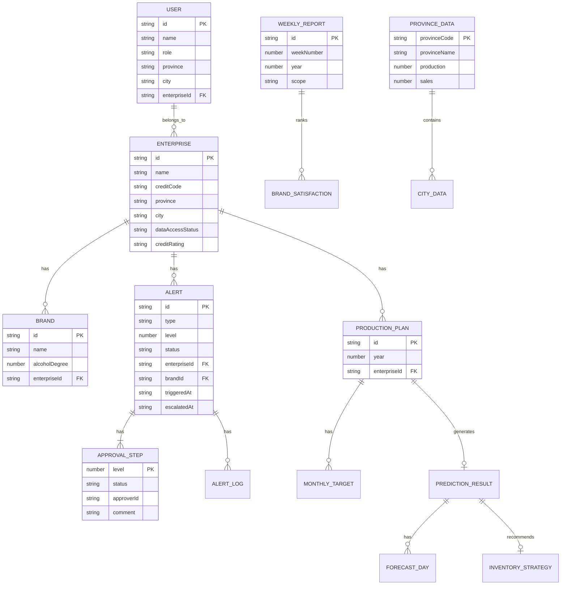

# 全国性酒类生产与流通智能监测分析平台 - 技术架构文档

## 1. 架构设计



## 2. 技术说明

- **前端框架**：React@18.2 + TypeScript@5 + Vite@5
- **初始化工具**：Vite脚手架 (React + TypeScript模板)
- **后端方案**：无后端，采用 Mock Service Worker + 本地模拟数据
- **数据持久化**：LocalStorage存储用户会话、筛选条件、报告草稿
- **UI组件库**：Ant Design@5 + 主题定制（深蓝金色主题）
- **图表引擎**：Apache ECharts@5 + 自定义中国地图GeoJSON
- **状态管理**：Zustand（轻量级全局状态）+ React Query（服务端状态缓存）
- **样式方案**：TailwindCSS@3 + CSS变量主题系统
- **动效方案**：Framer Motion@11 + CSS Transitions
- **Excel处理**：SheetJS (xlsx@0.18)
- **Mock方案**：Mock Service Worker (MSW) 浏览器端拦截 + faker.js数据生成
- **代码规范**：ESLint + Prettier + Husky + lint-staged

## 3. 路由定义

| 路由路径 | 页面名称 | 权限要求 | 说明 |
|---------|---------|---------|------|
| `/login` | 登录页 | 公开 | 账号密码登录、角色选择 |
| `/dashboard` | 核心监测看板 | 所有登录用户 | 根据角色过滤数据范围 |
| `/alerts` | 预警中心 | 监管用户+酒企质量总监 | 一级/二级预警列表与审批 |
| `/alerts/:id` | 预警详情 | 同上 | 预警详情与审批操作 |
| `/production-plan` | 生产计划管理 | 酒企+国家/省用户 | 计划上传、预测、库存策略 |
| `/reports` | 运营诊断报告 | 所有登录用户 | 周报列表与详情 |
| `/reports/:id` | 报告详情 | 同上 | 单份报告完整内容 |
| `/enterprises` | 企业管理 | 监管用户 | 酒企名录与接入管理 |
| `/enterprises/:id` | 企业详情 | 监管用户 | 单企业详情与历史数据 |
| `*` | 404页 | 公开 | 无效路由跳转 |

## 4. 数据类型定义

```typescript
// 用户与权限
interface User {
  id: string;
  name: string;
  role: 'national' | 'provincial' | 'municipal' | 'enterprise_qc' | 'enterprise_prod';
  region?: { province?: string; city?: string };
  enterpriseId?: string;
  avatar?: string;
  permissions: string[];
}

// KPI指标
interface KPIData {
  totalProduction: number;       // 总产量(万千升)
  totalSales: number;            // 总销量(万千升)
  productionSalesRatio: number;  // 产销率(%)
  avgInventoryTurnover: number;  // 平均库存周转天数
  qualityPassRate: number;       // 质量合格率(%)
  activeAlerts: number;          // 活跃预警数
  momChange: {                   // 环比变化
    totalProduction: number;
    totalSales: number;
    productionSalesRatio: number;
    qualityPassRate: number;
  };
}

// 省级产销数据
interface ProvinceData {
  provinceCode: string;
  provinceName: string;
  production: number;
  sales: number;
  ratio: number;
  qualityPassRate: number;
  alertCount: number;
  cities: CityData[];
}

// 地市数据
interface CityData {
  cityCode: string;
  cityName: string;
  sales7d: number[];             // 近7天销量
  salesTrend: number;            // 趋势%
  qualityIssues: QualityIssue[]; // 质检问题分布
  brands: BrandBrief[];
}

// 品牌信息
interface BrandBrief {
  id: string;
  name: string;
  alcoholDegree: number;
  production: number;
  sales: number;
}

// 质量问题分布
interface QualityIssue {
  type: 'alcohol' | 'additive' | 'label' | 'hygiene' | 'other';
  name: string;
  count: number;
  percentage: number;
}

// 预警信息
interface Alert {
  id: string;
  type: 'inventory' | 'quality';
  level: 1 | 2;
  title: string;
  description: string;
  enterpriseId: string;
  enterpriseName: string;
  brandId?: string;
  brandName?: string;
  province: string;
  city: string;
  triggeredAt: string;
  escalatedAt?: string;          // 升级时间
  threshold: number;
  actualValue: number;
  metricHistory: MetricPoint[];  // 历史指标数据
  status: 'pending' | 'processing' | 'reviewing' | 'approved' | 'resolved' | 'expired';
  processingDeadline?: string;   // 处理截止(一级预警+15天)
  approvals: ApprovalStep[];
  actionPlan?: ActionPlan;       // 限产/召回方案
  logs: AlertLog[];
}

// 审批节点
interface ApprovalStep {
  level: 1 | 2 | 3;              // 1=酒企 2=省局 3=国家局
  role: string;
  approverId?: string;
  approverName?: string;
  status: 'pending' | 'approved' | 'rejected';
  comment?: string;
  approvedAt?: string;
  attachments?: string[];
}

// 限产/召回方案
interface ActionPlan {
  type: 'limit_production' | 'recall';
  scope: string;
  quantity: number;
  duration?: string;
  measures: string[];
}

// 预警日志
interface AlertLog {
  timestamp: string;
  operator: string;
  action: string;
  detail: string;
}

// 数据点
interface MetricPoint {
  date: string;
  value: number;
  threshold: number;
}

// 生产计划
interface ProductionPlan {
  id: string;
  year: number;
  enterpriseId: string;
  enterpriseName: string;
  uploadedAt: string;
  uploadedBy: string;
  status: 'draft' | 'confirmed';
  monthlyTargets: MonthlyTarget[];
  predictionResult?: PredictionResult;
}

// 月度产量目标
interface MonthlyTarget {
  month: string;
  brandId: string;
  brandName: string;
  targetOutput: number;
  alcoholDegree: number;
}

// 预测结果
interface PredictionResult {
  generatedAt: string;
  forecast90d: ForecastDay[];
  marketGap: {                  // 市场缺口
    deficit: number;            // 缺口量(负=过剩)
    surplus: number;
    balanceDate?: string;       // 预计平衡日期
  };
  inventoryStrategy: InventoryStrategy;
}

// 预测日数据
interface ForecastDay {
  date: string;
  predictedSales: number;
  lowerBound: number;
  upperBound: number;
  plannedProduction: number;
  inventoryLevel: number;
}

// 库存策略
interface InventoryStrategy {
  safeStockDays: number;         // 最优安全库存天数
  recommendedSafetyStock: number; // 推荐安全库存量
  reorderPoint: number;          // 补货触发点
  reorderQuantity: number;       // 补货量
  turnoverOptimization: string[]; // 周转优化建议
}

// 运营诊断报告
interface WeeklyReport {
  id: string;
  weekNumber: number;
  year: number;
  startDate: string;
  endDate: string;
  generatedAt: string;
  scope: 'national' | 'provincial' | 'municipal';
  regionName?: string;
  metrics: ReportMetrics;
  qualityAnalysis: QualityAnalysis;
  satisfactionRanking: BrandSatisfaction[];
  optimizationSuggestions: string[];
}

// 报告指标
interface ReportMetrics {
  production: YoYMoM<number>;
  sales: YoYMoM<number>;
  productionSalesRatio: YoYMoM<number>;
  inventoryTurnover: YoYMoM<number>;
  qualityPassRate: YoYMoM<number>;
}

// 同比环比数据
interface YoYMoM<T> {
  current: T;
  yoy: number;                   // 同比%
  mom: number;                   // 环比%
  weeklyTrend: T[];              // 近7周趋势
}

// 质量分析
interface QualityAnalysis {
  totalIncidents: number;
  causeDistribution: { cause: string; count: number; percentage: number }[];
  topOffendingBrands: { name: string; incidents: number }[];
}

// 品牌满意度
interface BrandSatisfaction {
  rank: number;
  brandId: string;
  brandName: string;
  score: number;
  lastWeekRank: number;
  trend: 'up' | 'down' | 'flat';
}

// 酒企信息
interface Enterprise {
  id: string;
  name: string;
  creditCode: string;
  legalPerson: string;
  province: string;
  city: string;
  address: string;
  productionScale: 'small' | 'medium' | 'large';
  mainProducts: string[];
  dataAccessStatus: 'connected' | 'partial' | 'disconnected';
  creditRating: 'A' | 'B' | 'C' | 'D';
  lastConnectionAt?: string;
  registeredAt: string;
}

// 实时数据流
interface DataStreamRecord {
  id: string;
  type: 'production' | 'sales' | 'inventory' | 'quality';
  timestamp: string;
  enterpriseName: string;
  brandName?: string;
  summary: string;
  value?: number;
  unit?: string;
  status: 'normal' | 'warning';
}
```

## 5. 数据模型关系图



## 6. Mock数据初始化

```typescript
// 中国省份列表与基础编码
const PROVINCES = [
  { code: '110000', name: '北京市' },
  { code: '120000', name: '天津市' },
  { code: '130000', name: '河北省' },
  { code: '140000', name: '山西省' },
  { code: '150000', name: '内蒙古自治区' },
  { code: '210000', name: '辽宁省' },
  { code: '220000', name: '吉林省' },
  { code: '230000', name: '黑龙江省' },
  { code: '310000', name: '上海市' },
  { code: '320000', name: '江苏省' },
  { code: '330000', name: '浙江省' },
  { code: '340000', name: '安徽省' },
  { code: '350000', name: '福建省' },
  { code: '360000', name: '江西省' },
  { code: '370000', name: '山东省' },
  { code: '410000', name: '河南省' },
  { code: '420000', name: '湖北省' },
  { code: '430000', name: '湖南省' },
  { code: '440000', name: '广东省' },
  { code: '450000', name: '广西壮族自治区' },
  { code: '460000', name: '海南省' },
  { code: '500000', name: '重庆市' },
  { code: '510000', name: '四川省' },
  { code: '520000', name: '贵州省' },
  { code: '530000', name: '云南省' },
  { code: '540000', name: '西藏自治区' },
  { code: '610000', name: '陕西省' },
  { code: '620000', name: '甘肃省' },
  { code: '630000', name: '青海省' },
  { code: '640000', name: '宁夏回族自治区' },
  { code: '650000', name: '新疆维吾尔自治区' },
  { code: '710000', name: '台湾省' },
  { code: '810000', name: '香港特别行政区' },
  { code: '820000', name: '澳门特别行政区' }
];

// 白酒品牌库（产区/酒精度维度）
const BRAND_LIBRARY = [
  { name: '茅台飞天', region: '贵州省', degree: 53 },
  { name: '五粮液', region: '四川省', degree: 52 },
  { name: '国窖1573', region: '四川省', degree: 52 },
  { name: '剑南春', region: '四川省', degree: 52 },
  { name: '汾酒青花', region: '山西省', degree: 53 },
  { name: '泸州老窖', region: '四川省', degree: 52 },
  { name: '洋河梦之蓝', region: '江苏省', degree: 52 },
  { name: '郎酒青花郎', region: '四川省', degree: 53 },
  { name: '古井贡酒', region: '安徽省', degree: 50 },
  { name: '西凤酒', region: '陕西省', degree: 55 },
  { name: '董酒', region: '贵州省', degree: 54 },
  { name: '酒鬼酒', region: '湖南省', degree: 52 },
  { name: '水井坊', region: '四川省', degree: 52 },
  { name: '舍得', region: '四川省', degree: 52 },
  { name: '习酒窖藏', region: '贵州省', degree: 53 },
  { name: '牛栏山', region: '北京市', degree: 52 },
  { name: '红星二锅头', region: '北京市', degree: 56 },
  { name: '黄鹤楼', region: '湖北省', degree: 53 },
  { name: '白云边', region: '湖北省', degree: 42 },
  { name: '口子窖', region: '安徽省', degree: 41 }
];

// 质量问题类型
const QUALITY_ISSUE_TYPES = [
  { type: 'alcohol', name: '酒精度不符' },
  { type: 'additive', name: '添加剂超标' },
  { type: 'label', name: '标签标识违规' },
  { type: 'hygiene', name: '卫生指标不合格' },
  { type: 'other', name: '其他问题' }
];
```

## 7. 目录结构

```
src/
├── assets/                  # 静态资源
│   ├── fonts/              # 字体文件
│   ├── images/             # 图片资源
│   └── geojson/            # 中国地图GeoJSON
├── components/             # 通用组件
│   ├── layout/            # 布局组件(侧边栏、顶栏)
│   ├── charts/            # 图表组件(热力图、折线图等)
│   ├── common/            # 通用UI组件(卡片、空状态等)
│   └── forms/             # 表单组件
├── pages/                  # 页面组件
│   ├── Login/
│   ├── Dashboard/
│   ├── Alerts/
│   ├── ProductionPlan/
│   ├── Reports/
│   └── Enterprises/
├── store/                  # 状态管理
│   ├── useUserStore.ts
│   ├── useDashboardStore.ts
│   ├── useAlertStore.ts
│   └── index.ts
├── mocks/                  # Mock数据与服务
│   ├── handlers/          # MSW请求处理器
│   ├── data/              # Mock数据生成器
│   └── browser.ts         # MSW浏览器端启动
├── hooks/                  # 自定义Hooks
│   ├── usePermission.ts
│   ├── useChartTheme.ts
│   └── useDataStream.ts
├── utils/                  # 工具函数
│   ├── date.ts
│   ├── number.ts
│   ├── excel.ts
│   ├── permission.ts
│   └── mock.ts
├── types/                  # 类型定义
│   └── index.ts
├── constants/              # 常量
│   ├── regions.ts
│   ├── brands.ts
│   └── config.ts
├── styles/                 # 全局样式
│   ├── index.css
│   └── theme.css
├── App.tsx
├── main.tsx
└── router.tsx
```
